# RAG + Knowledge Graph (KAG) Architecture Documentation

## Overview

TheDrive implements a sophisticated hybrid retrieval system that combines **Retrieval-Augmented Generation (RAG)** with **Knowledge Graphs** to provide intelligent document search and conversational AI capabilities. This system processes user documents through multiple layers of analysis to create both vector embeddings and structured knowledge representations.

## System Architecture

### High-Level Components

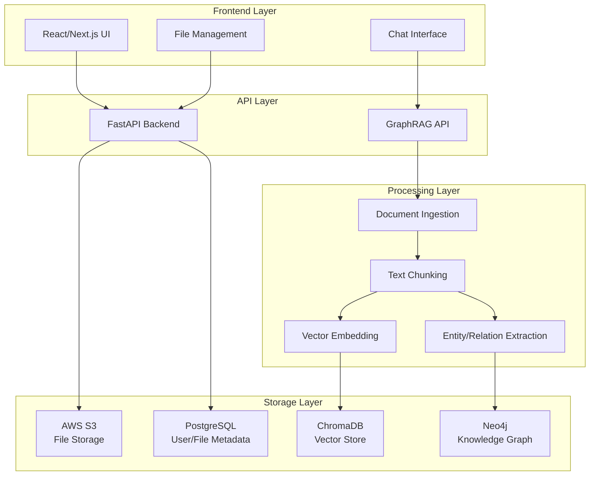

## Document Ingestion Pipeline

### 1. File Upload & Storage Flow

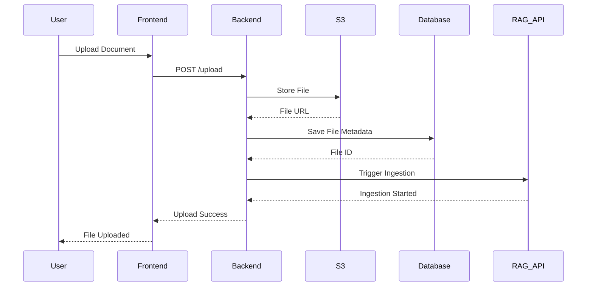

### 2. Document Processing Pipeline

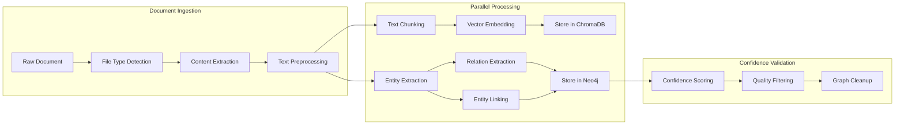

## RAG Implementation

### Traditional RAG Process

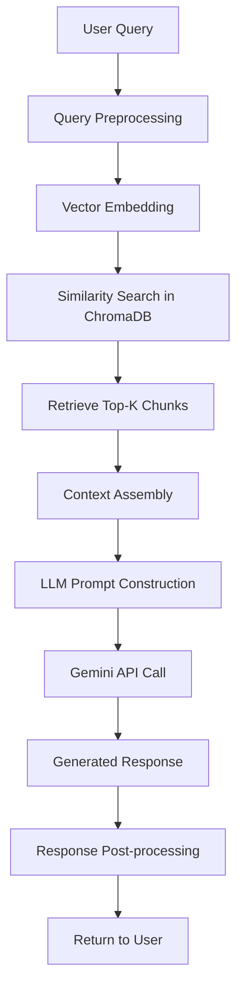

### Enhanced KAG Process

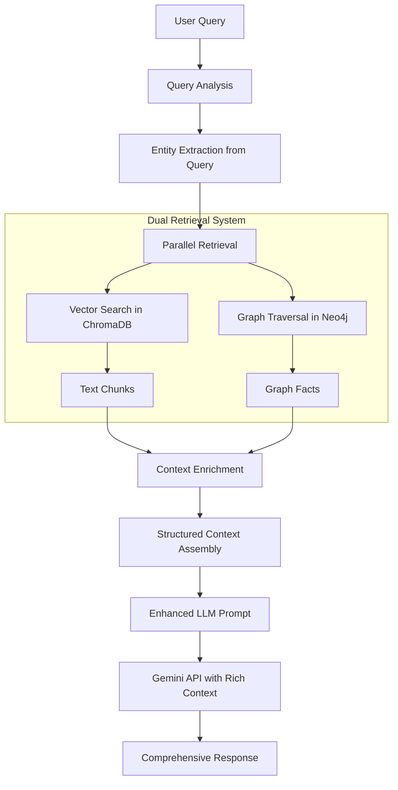

## Knowledge Graph Construction

### Entity and Relation Extraction

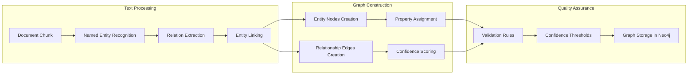

### Graph Schema

```cypher
// Example Neo4j Schema
(:Document {id, name, type, owner_id})
(:Entity {name, type, confidence, embedding_vector})
(:Person {name, title, organization})
(:Organization {name, industry, location})
(:Concept {name, definition, category})

// Relationships
(:Entity)-[:MENTIONED_IN]->(:Document)
(:Person)-[:WORKS_FOR]->(:Organization)
(:Entity)-[:RELATED_TO {confidence, type}]->(:Entity)
(:Document)-[:CONTAINS]->(:Entity)
```

## Query Processing Flow

### Step-by-Step Query Resolution

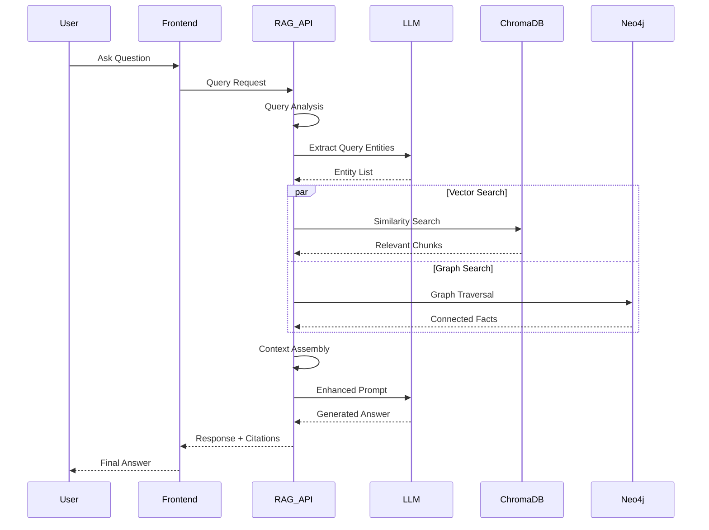

## Context Enrichment Strategy

### Information Layering

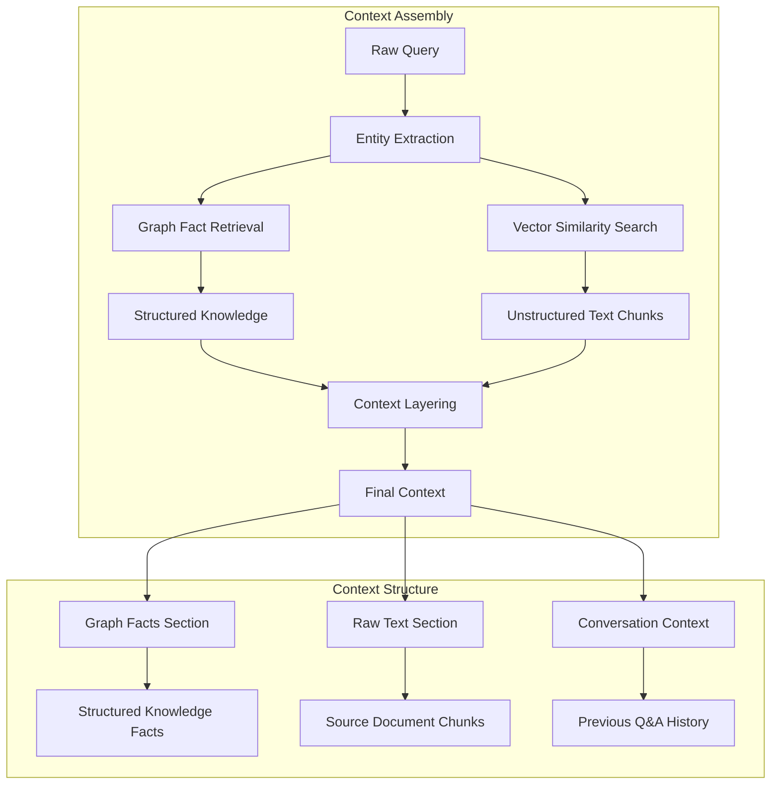

## File-Vector DB Mapping System

### Re-ingestion Feature Flow

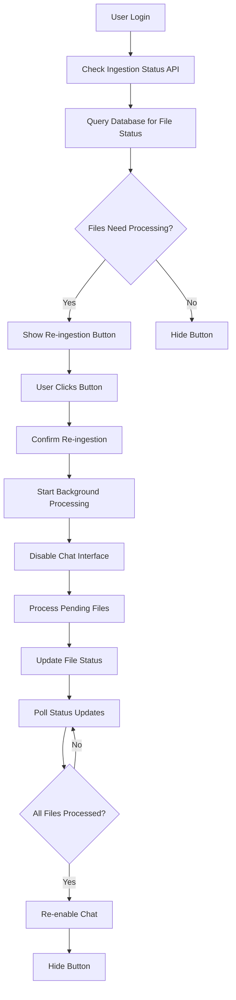

### Database Schema for File Tracking

```sql
-- FileSystemItem table tracks ingestion status
CREATE TABLE filesystem_items (
    id VARCHAR PRIMARY KEY,
    name VARCHAR NOT NULL,
    type VARCHAR NOT NULL, -- 'file' or 'folder'
    owner_id INTEGER REFERENCES users(id),
    parent_id VARCHAR REFERENCES filesystem_items(id),
    s3_key VARCHAR, -- For files only
    mime_type VARCHAR,
    size_bytes BIGINT,
    ingestion_status VARCHAR, -- 'pending', 'processing', 'completed', 'failed'
    created_at TIMESTAMP DEFAULT NOW(),
    updated_at TIMESTAMP DEFAULT NOW()
);
```

## Confidence-Based Quality Control

### Entity Confidence Scoring

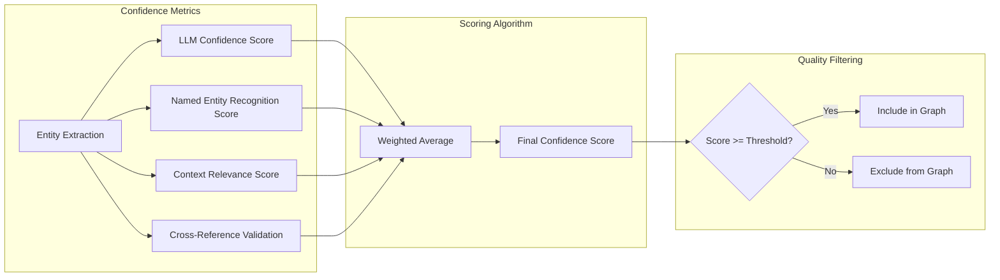

### Graph Cleanup Process

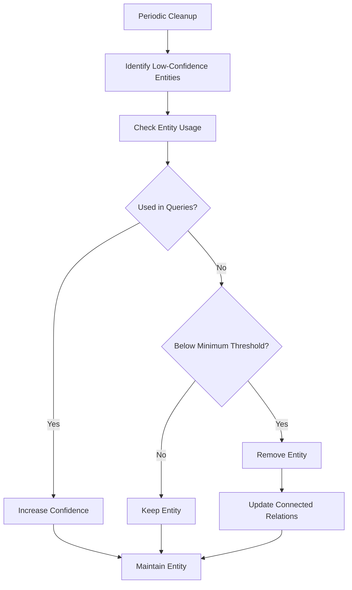

## API Endpoints

### Key RAG API Endpoints

```yaml
# Document Ingestion
POST /ingest/file
  - Upload and process document
  - Returns: ingestion_id, status

# Query Processing
POST /query/stream
  - Streaming RAG query with SSE
  - Returns: Server-Sent Events stream

GET /query
  - Non-streaming RAG query
  - Returns: answer, citations, confidence

# Graph Management
GET /graph/stats
  - Graph statistics and health
  - Returns: node_count, relationship_count, confidence_distribution

POST /graph/cleanup
  - Clean low-confidence entities
  - Returns: removed_count, updated_count

# Status Checking
GET /drive/check-ingestion-status
  - Check user files needing ingestion
  - Returns: needs_ingestion, files_count, is_active

POST /drive/reingest-files
  - Trigger re-ingestion of pending files
  - Returns: processed_count, failed_files
```

## Performance Optimizations

### Caching Strategy

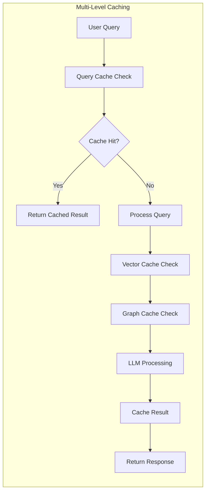

### Parallel Processing

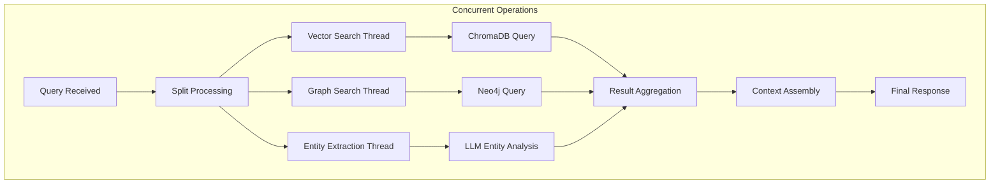

## Configuration Settings

### Environment Variables

```env
# GraphRAG Configuration
ENABLE_GRAPHRAG=1
ENTITY_CONFIDENCE_THRESHOLD=0.6
RELATION_CONFIDENCE_THRESHOLD=0.7
ENABLE_EMBEDDING_VALIDATION=1

# Vector Database
CHROMA_URL=http://chroma:8000
COLLECTION=thedrive

# Graph Database
NEO4J_URL=bolt://neo4j:7687
NEO4J_USER=neo4j
NEO4J_PASSWORD=password123

# LLM Configuration
GEMINI_API_KEY=your_api_key
MODEL_NAME=gemini-1.5-pro
RESPONSE_MODEL=gemini-2.5-pro

# Context Limits
MAX_CONTEXT_CHARS=12000
```

## Monitoring and Analytics

### System Health Metrics

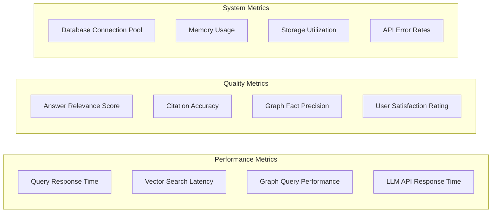

## Benefits of the Hybrid Approach

### RAG + KAG Advantages

1. **Enhanced Context Understanding**
   - Vector search provides semantic similarity
   - Knowledge graph provides structured relationships
   - Combined approach offers comprehensive context

2. **Improved Answer Quality**
   - Factual accuracy through structured knowledge
   - Contextual relevance through vector similarity
   - Reduced hallucination through grounded facts


